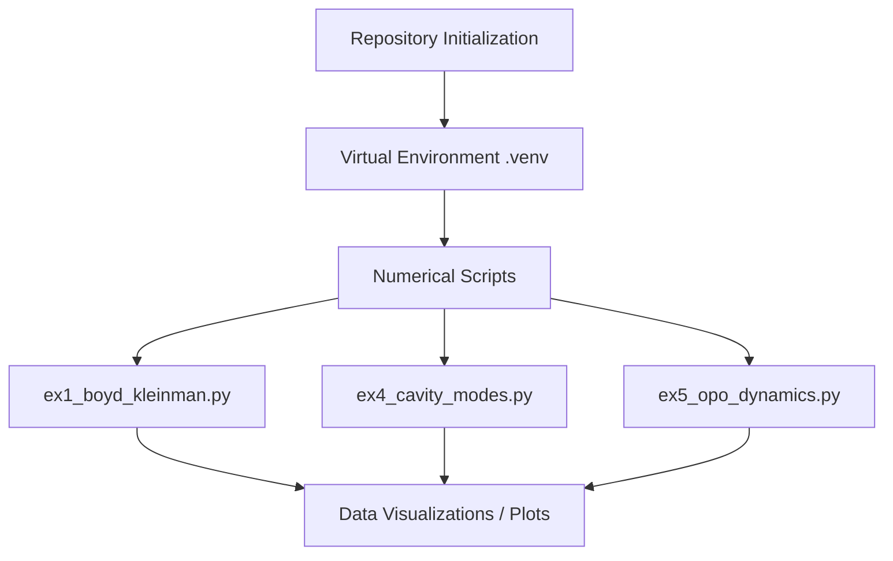

# ⚡ PGF5473 - Nonlinear Optics: Exercise Sheet 2

**Institute of Physics, University of São Paulo (IFUSP)** 

#### Graduate Program | First Semester 2026 | 

Assignment 2 

---

> 📘 **About this Repository:** > This repository contains the numerical simulations, analytical derivations, and documentation for the second exercise sheet of the course *Introduction to Nonlinear Optics*. It covers topics spanning Gaussian beam interactions, transverse mode transformations, cavity resonators, and Optical Parametric Oscillators (OPOs).
> 
> 

---

## 🧾 TL;DR

Computational and theoretical framework addressing advanced topics in nonlinear optics. Features Python-based numerical modeling for optimizing the Boyd-Kleinman overlap integral in Second Harmonic Generation (SHG) , laser mode structural analysis (Hermite-Gaussian vs. Laguerre-Gaussian) , and dynamical modeling of a doubly-resonant Optical Parametric Oscillator (OPO).

---

## 📋 Table of Contents

1. [Core Topics Coverered](https://www.google.com/search?q=%23-core-topics-covered)
2. [Theoretical Overview](https://www.google.com/search?q=%23-theoretical-overview)
3. [Repository Structure](https://www.google.com/search?q=%23-repository-structure)
4. [Environment Setup & Installation](https://www.google.com/search?q=%23-environment-setup--installation)
5. [Usage Guide](https://www.google.com/search?q=%23-usage-guide)
6. [Instructor & Credits](https://www.google.com/search?q=%23-instructor--credits)

---

## ⚛️ Core Topics Covered

* **Problem 1:** Numerical optimization of the Boyd-Kleinman criterion for SHG using Gaussian beams, alongside phase mismatch behavior comparisons with plane waves.


* **Problem 2:** Solving the paraxial wave equation in cylindrical coordinates to derive Laguerre-Gaussian (LG) modes.


* **Problem 3:** Block-diagonal linear transformations and superpositions between Hermite-Gaussian (HG) and Laguerre-Gaussian (LG) spatial modes.


* **Problem 4:** Modal frequency splitting calculations within optical resonators as a function of mirror curvature and cavity geometry.


* **Problem 5:** Derivation and numerical stability analysis of the dynamical equations governing a Doubly-Resonant OPO (DRO).


---

## 🔬 Theoretical Overview

### 1. Boyd-Kleinman Overlap Integral

For Second Harmonic Generation under Gaussian beam focusing, the effective nonlinear interaction relies heavily on the matching between the fundamental and second-harmonic wavefronts. The code evaluates this spatial overlap numerically to find the optimum focusing parameter:

$$h(\sigma, \xi) = \frac{1}{2\xi} \int_{-\xi}^{\xi} \int_{-\xi}^{\xi} \frac{\exp[i\sigma(\tau - \tau')]}{(1 + i\tau)(1 - i\tau')} d\tau d\tau'$$

### 2. Cavity Resonance Frequencies

The discrete spectrum of resonance frequencies $\nu_{mnq}$ for a stable transverse resonator configuration of length $L$ with mirror parameters $g_j = 1 - L/R_j$ is given by:

$$\nu_{mnq} = \frac{c}{2L} \left[ q + \frac{1}{\pi}(m + n + 1) \arccos\left(\pm\sqrt{g_1 g_2}\right) \right]$$

This relationship outlines how spatial configurations break the frequency degeneracy of high-order modes.

---

## 🛠️ Workflow Architecture



---

## 📁 Repository Structure

```bash
├── .gitignore                             # Prevents tracking .venv and IDE temporary files
├── LICENSE                                # MIT License
├── README.md                              # This documentation file
├── requirements.txt                       # Python dependencies
├── ex1_boyd_kleinman.py                   # Boyd-Kleinman numerical optimization script
├── ex4_cavity_modes.py                    # Cavity mode spacing simulation script
└── ex5_opo_dynamics.py                    # OPO dynamic equations solver

```

---

## 🚀 Environment Setup & Installation

To run the numerical modules locally, follow these steps to configure your isolated Python environment using standard best practices:

### 1. Clone the repository

```bash
git clone https://github.com/gutermanjunior/2026s1-pgf5473-nlo-exercisesheet2.git
cd 2026s1-pgf5473-nlo-exercisesheet2

```

### 2. Create and activate a Virtual Environment (`venv`)

* **On Windows:**
```bash
python -m venv .venv
.venv\Scripts\activate

```


* **On macOS/Linux:**
```bash
python3 -m venv .venv
source .venv/bin/activate

```


### 3. Install required packages

Ensure your package manager is updated, then install the stack:

```bash
pip install --upgrade pip
pip install -r requirements.txt

```

*(Note: Your `requirements.txt` should contain at least `numpy`, `scipy`, and `matplotlib`).*

---

## 💻 Usage Guide

Every assignment script is executable standalone from the terminal once the virtual environment is active.

* **To run the Boyd-Kleinman simulation (Problem 1):**
```bash
python ex1_boyd_kleinman.py

```


* **To visualize cavity resonance splitting (Problem 4):**
```bash
python ex4_cavity_modes.py

```


The generated figures are either displayed interactively or saved directly inside an auto-generated outputs structure depending on execution flags.

---

## 👨‍🔬 Instructor & Credits

* 
**Course Instructor:** Prof. Dr. Rafael Barros 


* 
**Institution:** Institute of Physics, University of São Paulo (IFUSP) 


* 
**Research Laboratory Group:** Quantum Spectroscopy Lab (QSLab) 


* **Student:** Guterman Rodrigues de Araujo Junior
* **Context:** M.Sc. Candidate in Physics 


---